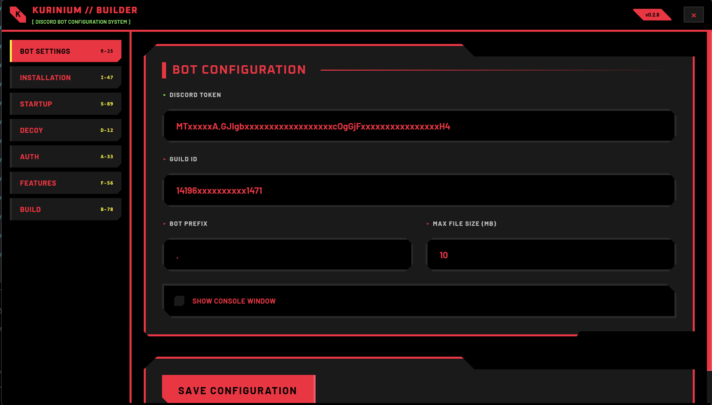

<div align="center">
  
</div>

<p align="center">
  <strong>Fast and Modern</strong> Rust-based <strong>Remote Administration Tool</strong><br/>
  Controlled with <a href="https://github.com/twilight-rs/twilight">Twilight-rs</a>
</p>

<p align="center">
  
  <br/><i>Builder for Kurinium~!</i><br/><br/>
  <a href="https://www.rust-lang.org/">
    
  </a>
  
  <a href="LICENSE">
    
  </a>
  <a href="https://discord.gg/tF64959UXv">
    
  </a>
  <br>
</p>

---

<div align="left">
  
</div>

Kurinium is a **Rust-based** project, newer and better than the legacy C++ version. 

- **Rust** – safer, modern, and faster than C++
- **Discord Integration** – controlled via [Twilight.rs](https://github.com/twilight-rs/twilight)
- **Customize** – Heavily customizable

---


## 🚨 Important: Discord Bot Setup

> **⚠️ WARNING: You MUST enable Discord Bot Privileged Gateway Intents!**
> 
> Go to [Discord Developer Portal](https://discord.com/developers/applications) → Your Application → Bot → Privileged Gateway Intents
> 
> **Enable these intents:**
> - ✅ MESSAGE CONTENT INTENT
> - ✅ SERVER MEMBERS INTENT  
> - ✅ PRESENCE INTENT
>
> **Without these, the bot will NOT receive messages!**

---

## 📦 Quick Start

### Prerequisites
- **Rust Toolchain** - [Install Rust](https://www.rust-lang.org/tools/install)
- **Node.js & npm** - [Install Node.js](https://nodejs.org/) (for builder UI)
- **Discord Bot Token** - [Create bot](https://discord.com/developers/applications)

### 1️⃣ Clone the Repository
```bash
git clone https://github.com/Mikasuru/Kukurinium.git
cd Kurinium
```

### 2️⃣ Build the Main Binary
```bash
# Build in release mode (optimized)
cargo build --release

# The compiled binary will be in: target/release/kurinium.exe
```
> **Note:** First build may take 5-15 minutes depending on your system

### 3️⃣ Launch the Builder (GUI)
```bash
# Navigate to builder directory
cd kurinium-builder

# Install dependencies
npm install
npm run build

# Launch the builder UI
npm run tauri dev
```

The builder will open a GUI where you can:
- Configure your bot token
- Set target channel ID
- Customize settings
- Build configured payloads

### 4️⃣ Configure & Deploy
1. **Get Discord Bot Token:**
   - Go to [Discord Developer Portal](https://discord.com/developers/applications)
   - Create new application → Bot → Copy Token
   - **⚠️ Enable privileged intents (see warning above)**

2. **Get Channel ID:**
   - Enable Developer Mode in Discord (Settings → Advanced)
   - Right-click channel → Copy ID

3. **Use the Builder:**
   - Enter bot token
   - Enter channel ID
   - Click "Build" to generate configured executable

# Run the binary
./target/release/kurinium.exe

---

## Contributing

Im welcome contributions of all kinds:
- **Bug reports** - Found an issue? Let me know
- **Feature requests** - Have an idea? Share it  
- **Code contributions** - Submit a PR
- **Documentation** - Help improve the docs

---

## License

MIT License - Use freely, but please give credit where due.

---

<div align="center">
  <br />
  <em>“No matter where you go… everyone is connected.”</em><br>
  <sub>Built with <3 - Kukuri</sub>
</div>
